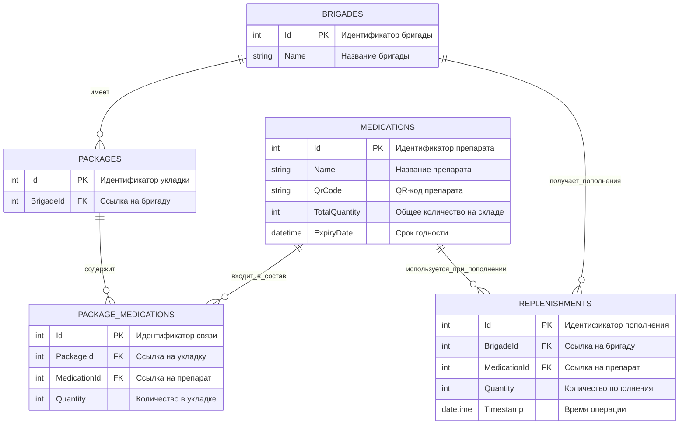
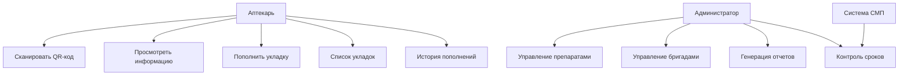
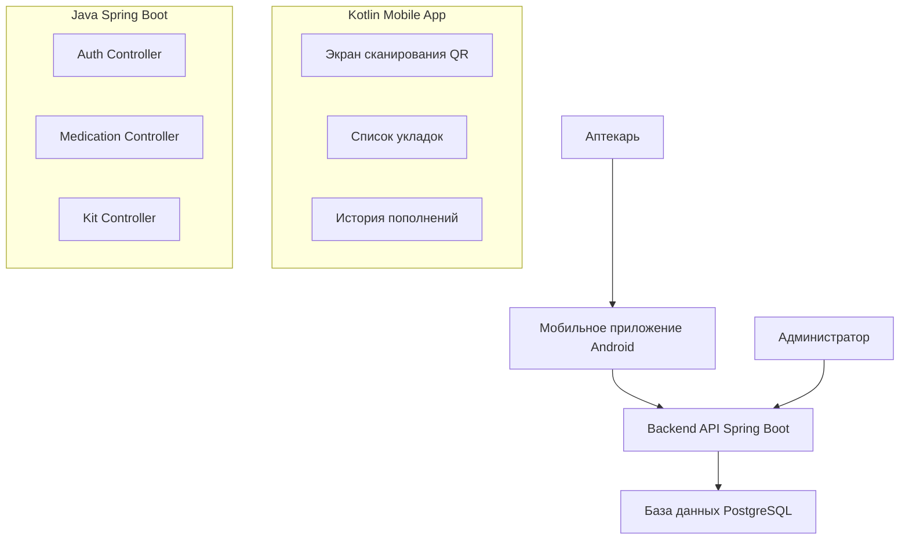

# pharmacy-smp
Аптека СМП - система управления медикаментами

## О проекте:

Автоматизация процесса пополнения укладок бригад СМП с использованием мобильного приложения и веб-сервиса.

## Технологии:

### Мобильное приложение

- Kotlin + Jetpack Compose
- Retrofit
- Koin/Dagger или другие редства
- Любые средства для сканирования QR-кодов

### Сервер
- Dotnet + ASP.NET
- Entity Framework
- PostgreSQL

Для взаимодействия между клиентом и сервером использовать протокол HTTP и REST-API паттерн

## Структура базы данных

## Связи:

- Brigade 1 → N Package - Одна бригада может иметь несколько укладок
- Brigade 1 → N Replenishment - Одна бригада может получать multiple пополнения
- Package N ←→ N Medication - Многие-ко-многим через PackageMedication
- Medication 1 → N Replenishment - Один препарат может использоваться в multiple пополнениях

## Сущности:

- Brigades - Бригады скорой помощи

- Packages - Укладки медицинских препаратов

- Medications - Медикаменты и препараты

- PackageMedications - Связь укладок с препаратами (количество)

- Replenishments - Журнал пополнений укладок

## Диаграмма прецедентов

## Архитектура системы

## Команда проекта

| ФИ | Роль | Выполненные задачи |
|-----|------|-------------------|
| **Мурзина Мария** | Тимлид / Архитектор | • Организация проекта и команды • Создание структуры проекта • Настройка Git репозитория • Составление плана разработки • Координация работы команды • Создание ER-диаграмм и документации • Распределение задач между участниками |
| **Симанова Мария** | Backend-разработчик (.NET + PostgreSQL) | • Создание ASP.NET Web API проекта • Настройка Docker с PostgreSQL • Настройка Entity Framework • Создание моделей данных • Разработка миграций БД • Создание API контроллеров • Реализация бизнес-логики |
| **Змеева Анна** | Mobile-разработчик (Kotlin/Compose) | • Создание Android проекта • Настройка зависимостей • Создание структуры приложения • Разработка UI экранов • Интеграция моковых данных • Настройка Retrofit • Реализация сканирования QR |
| **Нуртдинова Алина** | UI/UX Дизайнер | • Проектирование пользовательских интерфейсов • Создание макетов экранов • Разработка дизайн-системы • Подбор цветовой схемы и типографики 
| **Андриенко Алёна** | QA / Тестировщик | • Тестирование функциональности • Проверка интеграций • Тестирование API endpoints • Валидация бизнес-логики • Создание тестов |

